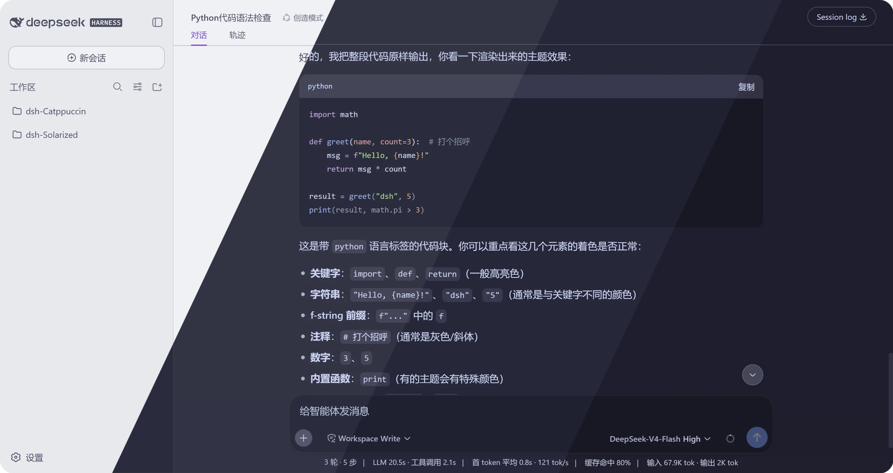
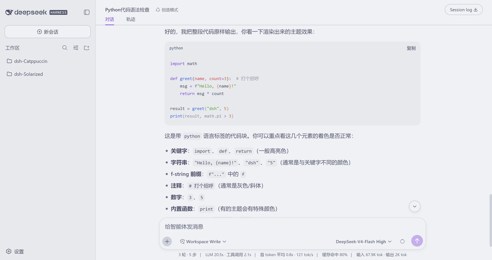
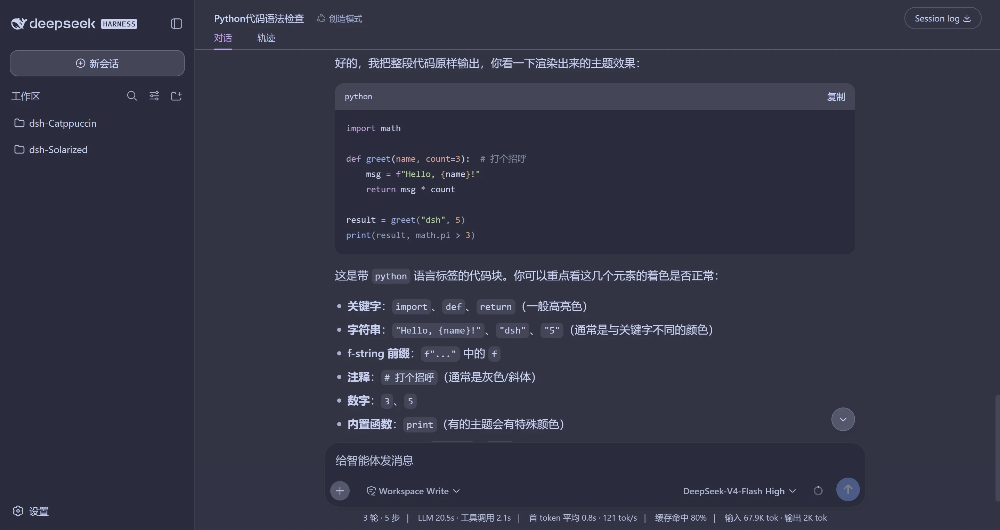
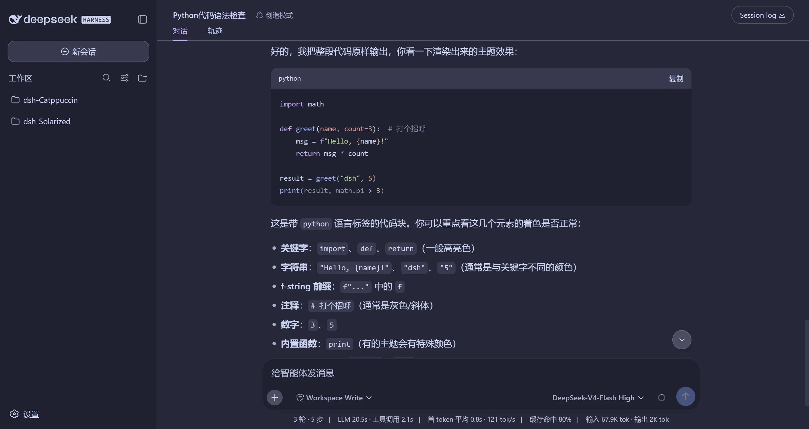
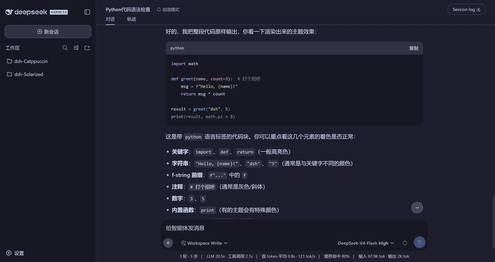

<h3 align="center">
	<br/>
	
	Catppuccin for <a href="https://github.com/deepseek-ai/deepseek-harness">DeepSeek Harness</a>
	
</h3>

<p align="center">
	<a href="https://github.com/zhijun-dai/Catppuccin-dsh-theme/stargazers"></a>
	<a href="https://github.com/zhijun-dai/Catppuccin-dsh-theme/issues"></a>
	<a href="https://github.com/zhijun-dai/Catppuccin-dsh-theme/contributors"></a>
</p>

<p align="center">
	<a href="README.md">English</a> | 中文
</p>

<p align="center">
	
</p>

## 预览

<details>
<summary>🌻 Latte</summary>

</details>
<details>
<summary>🪴 Frappé</summary>

</details>
<details>
<summary>🌺 Macchiato</summary>

</details>
<details>
<summary>🌿 Mocha</summary>

</details>

## 特性

- **完整、完全的Catppuccin颜色** —— 所有的颜色全部是Catppuccin色盘颜色，界面没有默认的 DeepSeek 蓝灰。
- **经典的 mauve 品牌色** —— 品牌色遵循 Catppuccin 传统用 mauve，而不是内置的蓝色。
- **记住你的选择** —— 所选风味按浏览器持久化在 `localStorage`，启动时自动恢复，即使宿主重新断言自己的偏好。
- **组件级染色** —— 不止 token：消息气泡、工具调用行、代码块标签、时间戳、首页标题与 hover 状态都用色盘上色，空工作区还有渐变标题。
- **对默认皮肤零侵入** —— 切回内置外观会逐像素还原，不留任何注入样式。
- **深浅四风味** —— Latte 与三个深色风味分别调校，每个风味在自己的底色上都协调。
- **只用色盘颜色** —— 每个值都是 Catppuccin 色盘颜色或色盘内混色，不引入族外色。

## 使用

这是 [DeepSeek Harness](https://github.com/deepseek-ai/deepseek-harness)（dsh）的双面主题插件。它把 Catppuccin 的四个风味（Flavor）注册进内置主题运行时，在 **设置 → 通用 → Catppuccin 主题** 中即可选择。

### 安装

从 GitHub 仓库安装：

```sh
dsh plugin --profile web add github:zhijun-dai/Catppuccin-dsh-theme
```

从本地目录安装（`-w` 参数必需——profile 目录是 pnpm workspace 根）：

```sh
dsh plugin --profile web add -w /path/to/Catppuccin-dsh-theme
```

从 npm 安装：

```sh
dsh plugin --profile web add dsh-catppuccin
```

> npm 版本可能滞后，获取最新版请用上面的 GitHub 安装方式（可用 `#分支名` 锁定分支）。

安装后重启 web 服务：

```sh
dsh web
```

### 切换主题

打开 Web UI，进入 **设置 → 通用**，选择四个 Catppuccin 风味之一（选「默认」恢复内置外观）。选择按浏览器保存在 `localStorage`。

## 工作原理

主题定义由官方 [catppuccin/palette](https://github.com/catppuccin/palette) 的 `palette.json` 生成（不手改色值）。`scripts/gen-themes.mjs` 把每个风味的 26 个 Catppuccin 颜色映射到 dsh `@deepseek-ai/dsh-client-ui-theme` 样式表的 `--dsw-alias-*` token 目录（含 `--shiki-*` 语法高亮色和少量泄漏的 `--dsw-static-deepseek-*` 静态色），写出 `themes/` 下的逐风味 token 表，并内嵌进浏览器端 bundle `lib/client.js`。

```sh
node scripts/gen-themes.mjs
```

## 💝 Thanks to

- [zhijun-dai](https://github.com/zhijun-dai)
- [Catppuccin](https://github.com/catppuccin)
- [KinGao294/dsh-skin](https://github.com/KinGao294/dsh-skin) — 本插件的参考实现
- [DeepSeek](https://github.com/deepseek-ai)

&nbsp;

<p align="center">
	
</p>

<p align="center">
	Copyright &copy; 2026-present <a href="https://github.com/zhijun-dai" target="_blank">zhijun-dai</a>
</p>

<p align="center">
	<a href="https://github.com/zhijun-dai/Catppuccin-dsh-theme/blob/main/LICENSE"></a>
</p>
